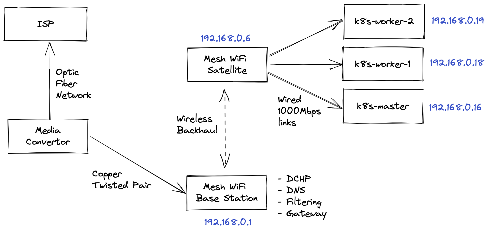
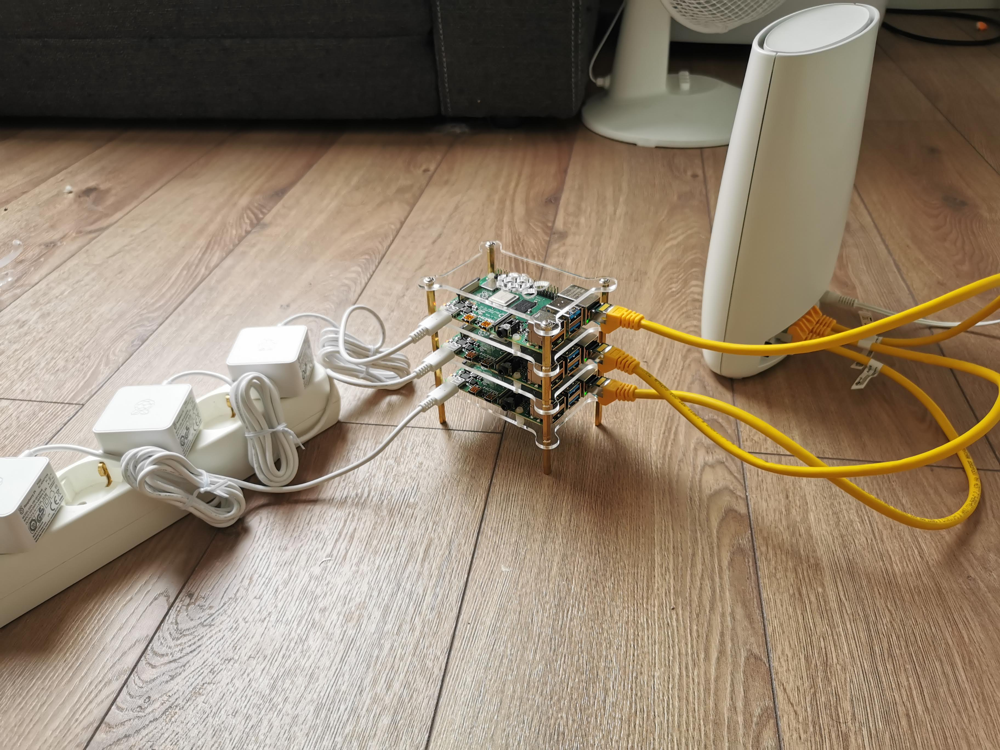

# hello-k8s-cluster
Setup scripts for the RPi cluster in my so called "homelab"
The setup uses K3S to setup the Kubernetes cluster on top of RPi 4B devices running RaspberryPi OS Lite version.

## Using the scripts
We use Ansible to setup the cluster. You need to have Ansible installed on the controller host(your laptop?).
Once you have cloned this repo use the syntax below to run the setup.
```bash
[luser@ansible-controller hello-k8s-cluster]$ cd ansible
[luser@ansible-controller ansible]$ ansible-playbook install-k3s-cluster.yml
```

### Assumptions
I have the following host names and IP addresses assigned to the RPi nodes. The scripts do assume this is the case in your network too.
This whole thing can be modularized but there's hardly any value
```bash
    k8s-master.local 192.168.0.16
    k8s-worker-1.local 192.168.0.19
    k8s-worker-2.local 192.168.0.18
```

## Network topology at home



**Current Setup**
* I run a Netgear Mesh WiFi system - It isn't the best but gets the job done mostly
* Base station sits on the ground floor and I have a satellite on each floor with Wireless Backhaul
* The base station pretty much does all the heavy lifting - DCHP, DNS, Gateway, Filtering the whole shebang.
* Each satellite has 4x 1000Mbps 
* Each RPi connects to an RJ45 port on a satellite - easy peasy
* 3x Class C IPs are reserved on the base station for the RPis' Mac address 

**Physical view**

